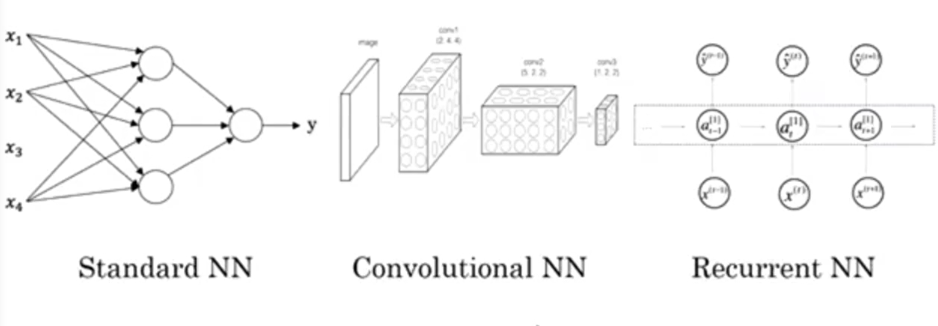

# Deep Learning_PyTorch 学习笔记

## 2021.11.19

### 1.两大函数

dir() --->查看文件包含什么

help()--->查看如何使用各类包

PyTorch如何加载数据：两个类---->Dataset(提供一种方式去获取数据及其label) 和 Dataloader(为后面的网络提供不同的数据形式)

Dataset:

F1:如何获取每一个数据及其label

F2:告诉我们总共有多少数据

### 2.read_data

```python
#通过Dataset类读取训练集
from torch.utils.data import Dataset  		#Dataset类包含在torch.utils.data包中
from PIL import Image						#利用PIL(Python Imaging Library )中的Image类
import os

class MyData(Dataset):

    def __init__(self,root_dir, label_dir):
        self.root_dir = root_dir
        self.label_dir = label_dir
        self.path = os.path.join(self.root_dir,self.label_dir)
        self.img_path = os.listdir(self.path)  #os.listdir(path)返回指定目录下的所有文件和目录名

    def __getitem__(self, idx):
        img_name = self.img_path[idx]
        img_item_path = os.path.join(self.root_dir,self.label_dir,img_name)
        img = Image.open(img_item_path)
        label = self.label_dir
        return img, label

    def __len__(self):
        return len(self.img_path)

#My_Data的实例化
root_dir = "dataset/train"
ants_label_dir = "ants"
bees_label_dir = "bees"
ants_dataset = MyData(root_dir, ants_label_dir)
bees_dataset = MyData(root_dir, bees_label_dir)

train_dataset = ants_dataset + bees_dataset

#测试案例
#img, label = ants_dataset[0]
#img.show()
```

### 3.rename_data

```python
#将read_data的数据写在text文件中
import os
#包装成函数
def rename_dataset(Root_dir, Target_dir, Out_dir):
    root_dir = Root_dir
    target_dir = Target_dir
    img_path = os.listdir(os.path.join(root_dir, target_dir))
    label = target_dir.split('_')[0]  
    #split 分割字符串  左边意为  按'_'分割成数组并取下标为0的元素
    #Q：在写txt文件中实际并没有按'_'分割
    out_dir = Out_dir
    for i in img_path:
        file_name = i.split('.jpg')[0]
        with open(os.path.join(root_dir, out_dir, "{}.txt".format(file_name)), 'w') as f:   #'w'表示只写
            f.write(label)

#调用函数
rename_dataset("dataset/train","bees_img","bees_label")
```

## 2021.11.20

### 1.Tensorboard 的使用

```python
from torch.utils.tensorboard import SummaryWriter  #SummaryWriater类
import numpy as np
from PIL import Image


writer = SummaryWriter("logs")  #创建一个叫'logs'的文件夹
img_path = "data/train/ants_image/67270775_e9fdf77e9d.jpg"  #图片地址
img_PIL = Image.open(img_path)  #打开图片
img_array = np.array(img_PIL)   #将PIL图片转化为Numpy型
print(img_array.shape)  #我们测试的numpy图片的shape是(512, 768, 3)，三通道在最后，所以我们需要使用dataformats来进行shape的规定
                        #从PIL--->numpy 我们需要在add_image()中指定shape中每一个数字/维表示的含义
writer.add_image("train", img_array, 1, dataformats='HWC')
# y = 2x 绘制图像
for i in range(100):
    writer.add_scalar("y = 2x", 2*i, i)
#可以在终端使用 tensorboard --logdir logs 输出图形 但是注意 logdir后面所跟为事件文件所在的文件夹名 同时我们可以使用Port+端口数字来改变输出端口


writer.close()
```

**Tensorboard**:https://pytorch.org/docs/stable/tensorboard.html

**NumPy**:(核心是ndarray 即 n-dimension array)是Python语言的一个扩展程序库。支持高阶大量的维度数组与矩阵运算，此外也针对数组运算提供大量的数学函数库。

**SummaryWriter**:SummaryWriter 类是记录数据以供 TensorBoard 使用和可视化的主要入口。是一种可视化日志。

**add_scalar**:

记录标量

```python
add_scalar(tag, scalar_value, global_step=None, walltime=None)
```

- tag：图像的标签名，图的唯一标识
- scalar_value：要记录的标量，y 轴的数据
- global_step：x 轴的数据

**add_scalars**:

上面的`add_scalar()`只能记录一条曲线的数据。但是我们在实际中可能需要在一张图中同时展示多条曲线，比如在训练模型时，经常需要同时查看训练集和测试集的**loss**。这时我们可以使用`add_scalars()`方法

```python
add_scalars(main_tag, tag_scalar_dict, global_step=None, walltime=None)
```

- main_tag：该图的标签
- tag_scalar_dict：用字典的形式记录多个曲线。key 是变量的 tag，value 是变量的值

**add_image**:

记录图像

```Python
add_image(tag, img_tensor, global_step=None, walltime=None, dataformats='CHW')
```

- tag：图像的标签名，图像的唯一标识
- img_tensor：图像数据，需要注意尺度(torch.Tensor, numpy.array  图片的类型大抵分为torch和numpy)
- global_step：记录这是第几个子图
- dataformats：数据形式，取值有'CHW'，'HWC'，'HW'。如果像素值在 [0, 1] 之间，那么默认会乘以 255，放大到 [0, 255] 范围之间。如果有大于 1 的像素值，认为已经是 [0, 255] 范围，那么就不会放大。

### 2.图像变化，Transforms 的使用


**Transforms**:将特定格式的图片--->Transforms.py--->我们想要的数据

```python
from PIL import Image
from torch.utils.tensorboard import SummaryWriter
from torchvision import transforms

#transforms 在 python 中的用法
#首先先要了解 Tensor 的数据类型 <--- 通过transforms.ToTensor解决两个问题
#Q1：how to use transforms?
#Q2: why Tensor?


img_path = "dataset/train/ants_img/6240338_93729615ec.jpg"  #Q: 为什么相对路径？ 绝对路径的'\'会被当作转义符
img = Image.open(img_path)  #PIL形式的pic
#print(img)


writer = SummaryWriter("logs")


#Q1：how to use transforms?
tensor_transforms = transforms.ToTensor()
tensor_img = tensor_transforms(img) # here we get a tensor pic
#print(tensor_img) 
#so we can see a RG-pic is 3-tensor

writer.add_image("Tensor_img", tensor_img)

writer.close()

#Q2: why Tensor?
#PIL_pic--->Image.open   numpy.ndarray--->opencv


#几个常见的transforms


#Normalize 的使用
#归一化
"""Normalize a tensor image with mean and standard deviation.
    This transform does not support PIL Image.
    Given mean: ``(mean[1],...,mean[n])`` and std: ``(std[1],..,std[n])`` for ``n``
    channels, this transform will normalize each channel of the input
    ``torch.*Tensor`` i.e.,
    ``output[channel] = (input[channel] - mean[channel]) / std[channel]``
#if we suppose mean(均值)[channel] = 0.5 and std（标准差)[channel] = 0.5 so we get output = (input - 0.5) / 0.5 
#---->  if input ranges between [0, 1] then optput ranges between [-1, 1]
    .. note::
        This transform acts out of place, i.e., it does not mutate the input tensor.

    Args:
        mean (sequence): Sequence of means for each channel.
        std (sequence): Sequence of standard deviations for each channel.
        inplace(bool,optional): Bool to make this operation in-place.

    """
#print(tensor_img[0][0][0])
trans_norm = transforms.Normalize([0.5, 0.5, 0.5], [0.5, 0.5, 0.5])
img_norm  = trans_norm(tensor_img)
#print(img_norm[0][0][0])
writer.add_image("Normalize_pic", img_norm)


#Resize() 的使用

#print(img.size)
trans_resize = transforms.Resize((512, 512))
img_resize = trans_resize(img)      #If the image is torch Tensor, it is expected   所以 transforms 只能处理 PIL 的Pic  所以我们在这里传进了 img.PIL
#To show how the picture have changed we transform it
img_resize = tensor_transforms(img_resize)  #here we us transforms to change img_resize.PIL into img_resize.tensor
#print(img_resize)

writer.add_image("Resize_pic", img_resize)  #for add_image we can only use .tensor or .ndarray

#Compose() 的使用
#compose()中的参数需要的是一个列表 而且 它其中的数据类型要为 Transforms 类型 所以 compose([transforms1, transforms2, ·······])
"""Composes several transforms together. This transform does not support torchscript.
    Please, see the note below.

    Args:
        transforms (list of ``Transform`` objects): list of transforms to compose.
        """
trans_resize_2 = transforms.Resize(512)
trans_compose = transforms.Compose([trans_resize_2,  tensor_transforms, trans_norm])
#Compose 是将各种 Transforms 结合起来  调用其对象时是按照[]参数列表中的顺序进行操作的
"""
    如上行 [trans_resize_2,  tensor_transforms, trans_norm] 
    那么我在执行 img_resize_2 = trans_compose(img)时就会  优先  调用trans_resize_2(img) 进行 resize 的变化
    其次  调用  tensor_transforms(img) 将 PIL 类型转化为 tensor 类型
    (由于 transforms.normalize 的对象 trans_norm 传入的参数必须为 tensor类型 所以放在最后调用)最后  调用  trans_norm 进行最后一步变化 
"""
img_resize_2 = trans_compose(img)  #注意：现在的 resize 可以使用 tensor 类型了


writer.add_image("Transforms_Compose", img_resize_2, 2)

writer.close()
```

 **how to use opencv to open a pic.numpy.ndarray?**

cv2.imread(path, flag)

flag指定应该读取图像的方式，默认值为cv2.IMREAD_COLOR

**cv2.IMREAD_COLOR:** It specifies to load a color image. Any transparency of image will be neglected. It is the default flag. Alternatively, we can pass integer value **1** for this flag.
**cv2.IMREAD_GRAYSCALE:** It specifies to load an image in grayscale mode. Alternatively, we can pass integer value **0** for this flag.
**cv2.IMREAD_UNCHANGED:** It specifies to load an image as such including alpha channel. Alternatively, we can pass integer value **-1** for this flag.

## 2021.11.26

### Introduction

#### **A basic neural network**

input ---> neural network (audio learning)---> output


(we call this function as ReLU function 它是一种激活函数)

just like you want to prediction the house prise

we can use size as input and prise as output 


And we will get a bigger neural network when we consider more 


In neural network we only need to give a 'x' as input  then the neural network will give you a 'y' .

#### **Machine learning(机器学习) & Supervised learning(监督学习)**

examples:


CNN RNN RNNs 




#### **激活函数**

**sigmoid**:


**ReLU**:

### Basics of Neural Network programming

#### Logistic regression: 

an algorithm for binary classification (我们用于输出1 或 0 的二元分类方法)

also it's a very very small neural network

example:

now here is a picture(cat)  what we want to do is that the computer will give us a 'y' = 1(is a cat) or 0(non a cat) when we input the picture

we suppose that the picture is 64 * 64

so a picture usually have 3 channel(R-red G-green B-blue ) and each channel is 64 * 64

and now we put them is a vector(row:64 * 64 * 3 and col :1)  this vector we call n<sub>x</sub> 

M_traim: training example:(x, y)  { (x<sup>(1)</sup>, y<sup>(1)</sup>), (x<sup>(2)</sup>, y<sup>(2)</sup>), ······ , (x<sup>(m)</sup>，y<sup>(m)</sup>) }

M_test:

so we can use a matrix X<sub>n<sub>x</sub>  * m</sub> = [x<sup>(1)</sup>, x<sup>(2)</sup>, ······ , x<sup>(m)</sup>] as the input M_train

we also use a matrix Y<sub>1 * m</sub> = [y<sup>(1)</sup>, y<sup>(2)</sup>, ······ , y<sup>(m)</sup>] as the output label


$$
Y = sigmoid(W * X + b)
$$

$$
Sigmoid-->

{\displaystyle S(t)={\frac {1}{1+e^{-t}}}.}
$$

In the logistic regression our tesk is to study W and b to get a right 'y'

Loss (error) function : 我们使用 Loss 函数计算我们训练的误差值
$$
L(y',y) = \frac{1}{2}(y'- y )^2
$$
但是由于上面的 Loss 函数在处理梯度下降时出现的问题我们使用另一种和上面差不多的 Loss 函数
$$
L(y', y) = -(y * log(y') + (1-y) * log(1-y') )
$$
how does is work?


but the Loss function is definated in a single train set

so we need a **Cost function**

it measures how well you're doing an entire training set

here it is
$$
J(W, b) = \frac{1}{m}\sum_{i =1}^mL(y'^{(i)},y^{(i)})
$$

#### Gradient Desce

### One hidden layer Neural Networks

### Deep Neural Networks


