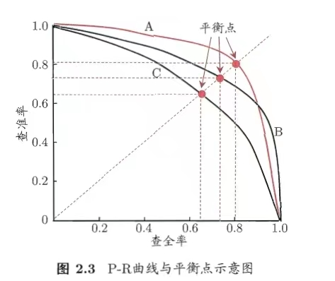
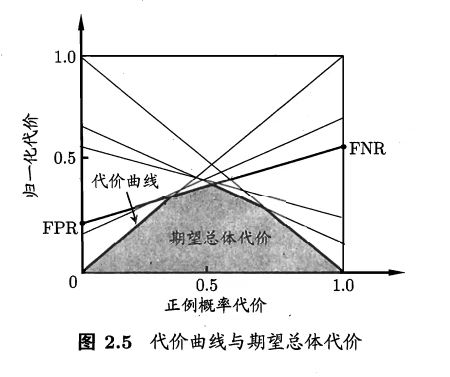
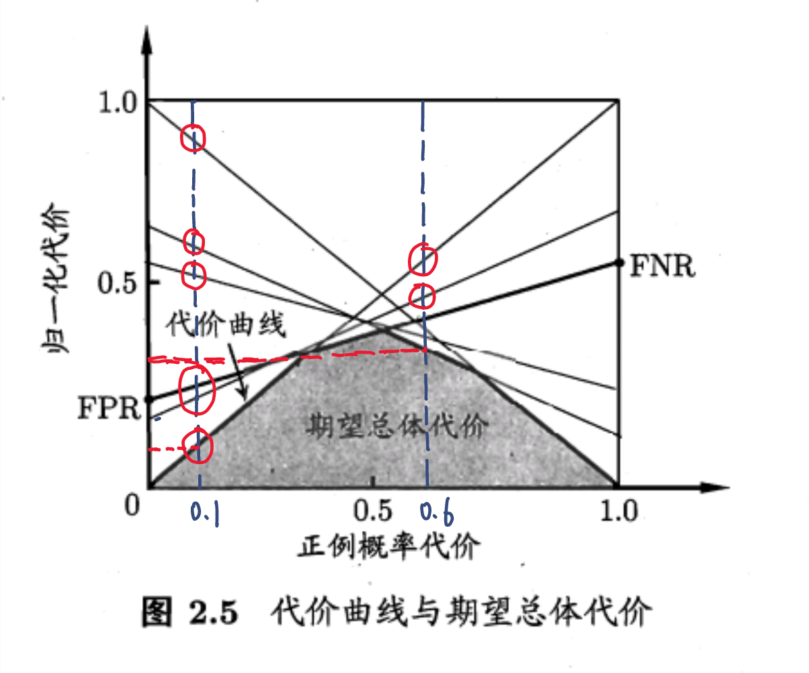

学习笔记：《机器学习》-周志华

# 第一章 绪论
---
# 第二章 模型评估与选择
## 2.1 经验误差与过拟合
m个样本中有a个样本分类错误
error rate：

$$
E = \frac{a}{m}
$$

acc：

$$
acc = 1-\frac{a}{m}
$$

误差（实际指误差期望）：**学习器的实际预测输出与样本的真实输出之间的差异**

过拟合
欠拟合

在

$$
P \neq NP
$$

情况下，过拟合无法避免！

## 2.2 评估方法
### a.留出法
### b.交叉验证法
### c.自助法

## 2.3 性能度量
给定样例集 

$$
D=｛(x_1,y_1),(x_2,y_2),...,(x_m,y_m)｝
，y_i是x_i的真实标签，
我们要评估学习器f的性能，需要将f(x)与真实标签y进行比较
$$

### (1).回归任务中的性能度量
#### a.均方误差
$$
E(f;D) = \frac{1}{m}\sum_{i=1}^m(f(x_i)-y_i)^2
\\
更一般的:
E(f;D) = \int_{x～D}(f(x)-y)^2p(x)dx
$$
### (2).分类任务中的性能度量
#### a.错误率与精度
对样例集D

$$
分类错误率：E(f;D)= \frac{1}{m}\sum_{i=1}^m\amalg(f(x_i)\neq y_i)
\\
分类精度：acc(f;D) = 1-E(f;D)
\\
更一般的:
E(f;D)= \int_{x～D}\amalg(f(x)\neq y)p(x)dx
\\
acc(f;D) = 1-E(f;D)
$$

#### b.查准率、查全率与F1
why?
E、acc仅仅反映了预测标签与真实标签错误或正确的比例，无法直观的反映错误或正确样本的比例
为此，我们提出混淆矩阵
**confusion matrix**

|真实情况|预测结果||
|-|-|-|
||正例|反例|
|正例|TP(真正例)|FN(假反例)|
|反例|FP(假正例)|TN(真反例)|

$$
查准率(准确率)： P = \frac{TP}{TP + FP}
\\
查全率(召回率)： R = \frac{TP}{TP + FN}
$$

查准率：挑出来的好西瓜中到底有多少是真正的好西瓜
查全率：真正的好西瓜中有多少被挑了出来
查准率与查全率是一对矛盾的度量，查准率高时，查全率偏低；反之亦然。
P-R曲线

Q：如何比较学习器A与学习器B的性能？
A:平衡点(Break-Event Point,BEP)<---过于简化，更常用的为F1度量

$$
F1 = \frac{2*P*R}{P+R} = \frac{2*TP}{样例总数+TP-TN}
\\
F1是基于查准率和查全率的调和平均:\\
\frac{1}{F1} = \frac{1}{2}*(\frac{1}{P}+\frac{1}{R})
$$

在不同的场景中，我们对查准率和查全率的侧重点不同，可以对P、R进行加权

$$
F_\beta = \frac{(1+\beta^2)*P*R}{(\beta^2*P)+R}
$$

0<$\beta$<1时：查准率有更大影响
$\beta$>1时：查全率有更大影响
#### c.ROC与AUC
**ROC曲线**

$$
真正例率：TPR = \frac{TP}{TP+FN}
\\
假正例率：FPR = \frac{FP}{FP+TN}
$$

若某学习器A将B的ROC曲线包住，则我们认为A优于B；若A，B有交叉，则需比较AUC，即ROC曲线下的面积。
:exclamation: ROC曲线绘制过程：参考南瓜书
#### d.代价敏感错误率与代价曲线——衡量不同错误造成的损失的大小
不同的错误会造成不同的后果且非均等代价
**代价矩阵（cost matrix）**
$cost_{ij}$表示将第$i$类预测为第$j$类样本的代价

|真实类别|预测类别||
|-|-|-|
||第0类|第1类|
|第0类|0|$cost_{01}$|
|第1类|$cost_{10}$|0|

在非均等代价下，我们希望最小化总体代价。
不妨假设第0类为正类，第1类为反类，则可定义代价敏感错误率：

$$
E(f;D;cost) = \frac{1}{m}\Bigg(\sum_{x_i\in D^+}\amalg(f(x_i)\neq y_i)*cost_{01}+\sum_{x_i\in D^-}\amalg(f(x_i)\neq y_i)*cost_{10}\Bigg)
$$

:exclamation: :exclamation: :exclamation:如何理解代价曲线？
**两个公式：**

$$
横轴：P(+)cost = \frac{p*cost_{01}}{p*cost_{01}+(1-p)*cost_{10}}（公式1）
\\
纵轴：cost_{norm} = \frac{FNR*p*cost_{01}+FPR*(1-p)*cost_{10}}{p*cost_{01}+(1-p)*cost_{10}}（公式2）\\ =FNR*P(+)+FPR*(1-P(+))（公式3）
$$

**几个参数：**
$cost_{01}$:将原本为正例的样本错分为负例的代价
$cost_{10}$:将原本为负例的样本错分为正例的代价
假设我们认为将正例错分为负例的代价更大，则有$cost_{01}$>$cost_{10}$,反之亦然。
p:样例为正例的概率
P:正例概率代价。由公式1可知P（+）与p正相关。当p趋向于0时，即样本中几乎没有正例时，我们由公式1可知P(+)趋向于0,这说明我们几乎无法将正例错分为负例（因为正例很少），此时正例概率代价几乎为0；当p趋向于1时，即样本中几乎全是正例时，我们由公式1可知P(+)趋向于1,这说明我们的正例概率代价来源于将正例错分为负例（因为正例很多），此时正例概率代价几乎为1（因为正例这么多的情况下，你分类出现了错误，那你代价要大一些）。由公式3，我们显然得知，当P(+)=0时，$cost_{norm}=FPR$;当P(+)=1时，$cost_{norm}=FNR$。
FNR:假反例率，表示在真实标签为正例的情况下错分为反例的比例
FPR:假正例率，表示在真实标签为反例的情况下错分为正例的比例
**明确一个点：**
我手上有训练好的模型和样本，正例概率我也知道，现在我的模型会给每个样本打分，然后我设置一个阈值，模型将每个样本的分数和阈值进行比较，继而实现分类，而代价曲线的作用就是找到一个最为合适的阈值，使得分错的情况最少

现在我们看上图
在P（+）= 0.1时，使得归一化代价最小的是对角线这条代价曲线，即（FPR=0，FNR=1）这条曲线，而其他（FPR，FNR）曲线则是在P（+）=0.1的条件下选择不同的阈值形成的代价曲线。那么如何理解最低代价是这条曲线呢？我们不妨想反正我现在的正例概率代价已经很小了，只有0.1，因为P（+）与p正相关，也就是说我的p也很小，那么我不如把我的分类阈值设置的较为严苛，让预测结果全为负例，那么我的模型的分类效果依然会很棒；同样在P（+）=0.6的条件下，同理，反映了我的p较大，那么我不妨将分类阈值设置的较为宽松，使得更多的样本被划分为正例，这样我的准确率也会很好。

现在我们考虑如下的情况：
假设我们认为$cost_{01}$=$cost_{10}$时，有$P^1$(+)；那么当我们认为$cost_{01}$>$cost_{10}$时，由公式1分析可知，$P^2$(+)>$P^1$(+),对应到曲线中，应该右移，相应的阈值应该会设置地更为宽松，因为我们认为将正例错分为负例的损失更大，所以我们要更谨慎地划分负例，即划分更多的正例避免将正例错分为负例；同样的道理，当我们认为$cost_{01}$<$cost_{10}$时，也有相应的结论。

## 2.4 比较验证

